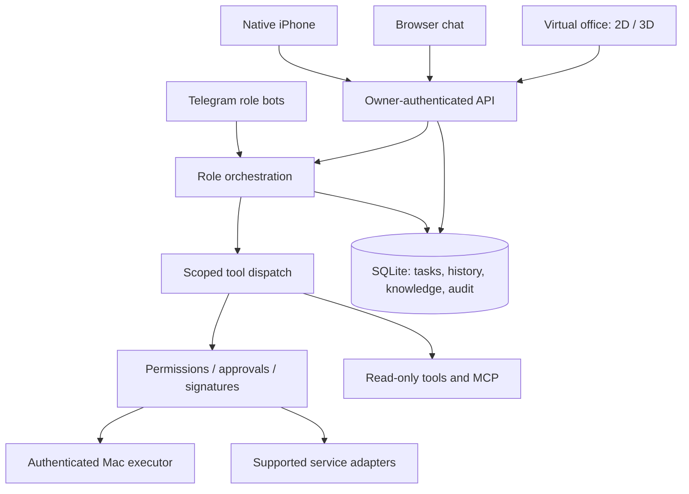

# DOBROPALM Agent

**A Russian-first personal assistant with a twelve-role engineering team, native iPhone client and interactive virtual office.**

Built to turn a request into a verified result: understand the goal, select an available tool, delegate a bounded task, obtain required approval, execute and check the outcome. The engineering focus is reliable execution across clients—not unrestricted autonomy.

[Engineering case study](docs/PORTFOLIO.md) · [Architecture & execution design](docs/personal-agent/EXECUTION_DESIGN.md) · [Tools & MCP](docs/personal-agent/TOOLS_AND_MCP.md) · [Security](SECURITY.md) · [CI](https://github.com/kevinscott66/ai-agents/actions)

> **Project status:** actively developed personal software. Features in source are not a promise that every integration is configured or deployed. External accounts, a configured backend and, for local operations, a connected Mac are required. There is no public unauthenticated assistant demo or preconfigured banking access.

## Product surfaces

| Surface | Purpose |
| --- | --- |
| **Telegram team** | Twelve separately configured role bots, bounded delegation, tasks and approvals |
| **Native iPhone app** | Owner-paired conversations, voice, attachments, project memory and action confirmation |
| **Browser chat** | Shared native conversation history and approvals at `/chat/` |
| **Virtual office** | Twelve fictional young-adult role avatars with dedicated workstations; 2D mode and optional 3D at `/office/` |
| **Operator Mini App** | Tasks, permissions, logs, agents and operational controls |
| **Mac bridge** | Local project work and supported desktop actions through an authenticated executor |

The office's local demo generates mock activity without model calls. In connected mode, role-bound conversations use the existing backend. Office animation never creates work or proves productivity. 3D renders in the browser; hosting the backend does not move rendering off the user's device.

## What is implemented

- **A coordinated team.** Lead, PM, Product, Backend, Frontend, Telegram, AI, QA, SMM, Copy, Design and Permissions roles. Delegation preserves author identity and has cycle/depth limits.
- **Scoped memory.** Conversation and project knowledge with message provenance and explicit sharing. Private native history is separate from Telegram group history.
- **Recoverable conversations.** Durable turn IDs, owner/device checks, role binding and polling after uncertain delivery. iPhone uses the server's conversation role; the office keeps the selected dialog stable across updates from other devices.
- **Voice and media.** Transcription → agent execution → generated speech, plus authenticated attachments and image providers. This is a chained voice pipeline, not full-duplex speech-to-speech.
- **Controlled execution.** Role permissions, approval queues, signed purchase flows, audit records and uncertain-outcome handling. A submitted request is not reported as a completed action.
- **Tools and MCP.** Internal team MCP, capability/configuration inspection and an official GitHub MCP adapter restricted to reading files, issues and PRs in the configured repository. Existing integrations cover web search, project work, DNS, media and supported Yandex workflows.

## Integration boundaries

| Integration | Current scope |
| --- | --- |
| GitHub | Read-only status/MCP plus a constrained code-task → PR workflow; merge and deployment remain separately controlled |
| Yandex Go, food, groceries and delivery | Specialized browser workflows through the Mac executor, with preparation, confirmation and result checks; login and compatible service pages are required |
| T-Bank personal account | Local iPhone transfer preparation and opening the bank; the proposed banking executor is **not implemented** |
| Computer and servers | Supported Mac commands and authorized project/CLI execution; not arbitrary control of every device or host |
| Office status | Owner-attributed execution, personal tasks and approval state; not a complete feed of every background worker or group member |

See [the tool inventory](docs/personal-agent/TOOLS_AND_MCP.md) for prerequisites. A configured flag or installed MCP does not establish account access or successful end-to-end execution.

## Architecture



**Stack:** TypeScript · Bun · SQLite · Claude Agent SDK / configured model providers · Telegram Bot API and optional MTProto · Swift/SwiftUI · React / React Three Fiber / Three.js · Preact · Vite · Playwright · GitHub Actions.

## Explore locally

Run the virtual office demo without personal service credentials:

```sh
git clone https://github.com/kevinscott66/ai-agents.git
cd ai-agents/virtual-office
bun install --frozen-lockfile
bun run dev
```

Requires Bun 1.3.14+ and Node 22. Open `http://127.0.0.1:4317`. The local demo is explicitly simulated. See [office setup](virtual-office/README.md).

For the agent backend, start from the repository root:

```sh
cd agent
bun install --frozen-lockfile
cp .env.example .env
# Configure model access, bot tokens and explicit allowlists before starting.
bun run typecheck
bun test tests
bun run start
```

Use [agent/.env.example](agent/.env.example) as the configuration reference. Each role has its own bot-token variable; an empty Telegram allowlist denies access. Keep credentials outside Git. Native pairing, Mac permissions and signed iOS distribution require operator setup; they are not provisioned by cloning this repository.

## Verification

The repository contains regression suites for authorization, ownership isolation, approvals, role dispatch, uncertain execution, database recovery and client synchronization. Browser tests exercise the office and reconnect behavior; Swift fixtures cover native contracts and state recovery.

```sh
# From agent/
bun run typecheck
bun test tests

# From virtual-office/
bun test tests
bun run build
# Start the local demo before browser scenarios:
bun run test:browser

# From repository root, on macOS with Xcode tools:
python3 ios/tests/run.py
```

Use the [CI run for the exact revision](https://github.com/kevinscott66/ai-agents/actions) as evidence. Test counts change; passing unit tests is not a security certification or proof that a live payment/order succeeded.

## Repository map

```text
agent/          orchestration, tools, integrations, tests, Mini App, Mac bridge
virtual-office/ browser office, contracts, demo gateway and browser tests
ios/            native SwiftUI client and regression fixtures
docs/           architecture, contracts, implementation status and case study
site/           companion site sources
deploy/         deployment templates and operational tooling
```

## Roadmap and limits

The durable goal → task → turn → approval model, additional executor readiness probes, isolated server-side browser workers and the personal banking executor remain separate work. Human login and bank challenges are not bypassed. Production setup and provider credentials are intentionally not distributed with the portfolio.

Read the [engineering case study](docs/PORTFOLIO.md) for design decisions and trade-offs, and [SECURITY.md](SECURITY.md) for reporting guidance. MIT licensed: [LICENSE](LICENSE).
