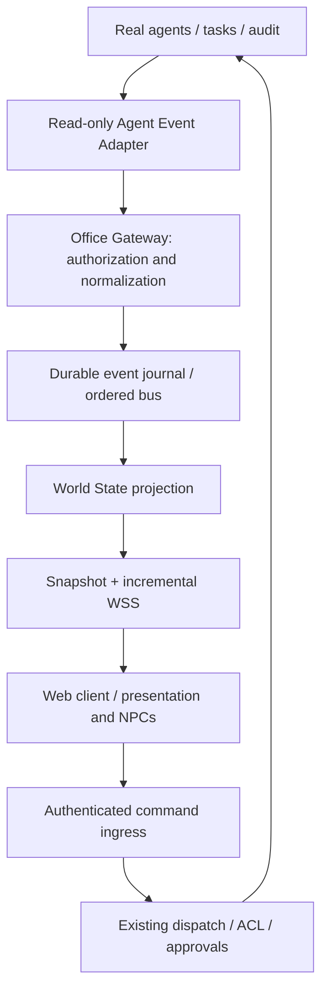

# DOBROPALM Virtual Office — target architecture

Статус: целевая архитектура после принятого checkpoint A/B. Первый mock runtime C/D реализован; точный scope и отличия — в [IMPLEMENTATION_STATUS](IMPLEMENTATION_STATUS.md). Основание: [исследование](EXISTING_SYSTEM.md), [протокол](EVENT_MODEL.md), [состояния](AGENT_STATE_MODEL.md), [план](IMPLEMENTATION_PLAN.md).

## Решение о движке

**Выбираем React + React Three Fiber + Three.js для размещения на сайте**, согласно уточнению пользователя после первого предложения UE. Gateway и агенты работают на сервере, браузер — интерфейс. UE не входит в текущий implementation scope.

| Критерий | Unreal | React + R3F + Three.js |
|---|---|---|
| Персонажи и анимация | более полный готовый skeletal/IK pipeline | PBR/glTF, animation mixer; IK/locomotion требуют отдельной интеграции |
| Размещение на сайте | GPU server + Pixel Streaming для полноценного UE клиента | обычная доставка web assets + WSS |
| Нагрузка пользователя | при streaming в основном декодирование видео | локальный WebGL GPU/CPU rendering |
| Серверные затраты | выделенный GPU, streaming sessions, bandwidth | статические assets и небольшой gateway, без GPU для rendering |
| UI | streamed UMG | читаемый DOM overlay |
| Навигация и мебель | встроенные engine systems | navmesh/steering, collision и animation anchors интегрируем отдельно |

**Сайт не переносит WebGL-рендеринг на сервер автоматически.** Текущее решение минимизирует локальную нагрузку, но не исключает её: ограничение 30 FPS, adaptive DPR, LOD, baked lightmaps, пауза скрытой вкладки и опциональный 2D режим. Если требование означает полностью удалённый рендеринг, нужен отдельный GPU streaming deployment; его стоимость, задержку и доступность надо оценить до реализации. Не обещаем нулевую нагрузку от browser 3D.

На исследованной машине M1 Pro / 16 GB; используем её как нижний профиль тестирования браузерного клиента. Начальные персонажи — rigged glTF с PBR и hair cards, не декоративные low-poly фигуры. Реалистичность повышаем после проверки animation pipeline и бюджета. UE остаётся архитектурной альтернативой для будущего GPU streaming, но не параллельной реализацией. Для веб-персонажей нужны лицензированные модели и sit/stand/walk/typing clips с единым skeleton; библиотеку IK/navigation выбираем небольшим spike и фиксируем версии перед внедрением.

Официальные источники, проверены 2026-09-23:
- [UE macOS requirements](https://dev.epicgames.com/documentation/en-us/unreal-engine/macos-development-requirements-for-unreal-engine).
- [MetaHuman hardware/platform requirements](https://dev.epicgames.com/documentation/metahuman/metahuman-hardware-requirements-in-unreal-engine?lang=en-US).
- [IK Rig](https://dev.epicgames.com/documentation/unreal-engine/unreal-engine-ik-rig), [Motion Matching](https://dev.epicgames.com/documentation/unreal-engine/motion-matching-in-unreal-engine).
- [R3F introduction](https://r3f.docs.pmnd.rs/getting-started/introduction), [performance](https://r3f.docs.pmnd.rs/advanced/scaling-performance).

## Независимые слои

Gateway — отдельный Bun/TypeScript service с собственной SQLite projection/journal. На первом этапе mock-only, loopback. Один writer сериализует события и обновление WorldState в одной транзакции. Kafka/Redis не нужны для одного офиса. Engine-neutral protocol schemas не импортируют Bun, Three.js, Telegram или LLM SDK.

Минимально инвазивная real integration: backend отдаёт узкую owner-scoped read projection и notifications после commit; адаптер перечитывает committed данные. Backend-local hook только кладёт sanitised invalidation в ограниченную очередь, никогда не ждёт office network. Gateway outage не останавливает агента. Потеря очереди выставляет degraded и требует reconciliation; не выдаём best-effort events за полный audit. Более точные lifecycle hooks добавляются отдельно после тестов. Напрямую импортировать `db.ts` в gateway нельзя: импорт создаёт/инициализирует DB.

## WorldState

`{schemaVersion, streamId, seq, generatedAt, sourceHealth, agents, tasks, communications, meetings, infrastructure, projects}`.

Карты имеют стабильные ID и revision. AgentState описан отдельно; Task содержит подтверждённый backend status, ownership, assignment, nullable progress; Communication — отправитель/получатель, task correlation и безопасная сводка; Meeting — backend intent, participants/topics/status; Project — display name и проверенные repository references. Infrastructure по умолчанию `capability: unavailable`, без выдуманного uptime. Удаление сущности — tombstone. Ограниченные recent actions и communications, пагинируемая история; raw logs в snapshot не включаем.

Позиции, позы, кофе, gaze и маршруты — локальная PresentationWorld, вне авторитетного WorldState. Несколько клиентов могут показать разные ambient движения при одинаковой реальной работе.

## Клиент и взаимодействие

`OfficeConnection` принимает и проверяет transport; `WorldStateStore` применяет reducer; `AgentController` выбирает visual intent; `AgentCharacter` исполняет locomotion/animation. Конфигурация связывает agentId, workstationId, avatar asset, seat anchors. Gameplay logic не знает prompts/credentials/providers.

Third-person player: kinematic player controller, collision, follow camera и независимый input abstraction для будущих first-person/mobile/VR. NPC: navmesh, avoidance, chair reservations, align/sit/stand animation clips, gaze limits и плавный blend. Подход игрока (~2 м, настраиваемый радиус + line-of-sight) даёт E/Talk; gaze сам по себе не вызывает backend. UI focus отключает movement input.

Inspect screen открывает читаемый DOM overlay с role/task/status/project/file/repo/branch/actions/tools/tests/progress/blockers, freshness и provenance. Неизвестное поле показывается «нет данных». Дальний монитор — дешёвый материал, не desktop capture. Repository URL разрешается только для проверенного HTTPS host; никаких shell/file URL.

Direct chat: office command адресован конкретному roleId; новый backend ingress обязан использовать тот же role execution boundary и ACL без обязательного Lead-hop. Разговор не отменяет активную работу: очередь по существующему policy, явные queued/accepted/completed/failed. Mock chat помечен MOCK и не изображает реальный LLM. До real ingress UI capability directChat=false.

Планировка: современный офис в реальном масштабе, 12 specialist slots + место Lead, сейчас 11 занятых specialist slots; стеклянная переговорная, lounge/kitchen, server room shell. PBR, дерево/металл/стекло, естественный свет, без cyberpunk. Начинаем с рабочего места одного агента, масштабируем после vertical slice.

## Trust boundary и риски

Gateway auth: отдельная owner-scoped сессия, TLS вне loopback, short-lived WS ticket; auth до snapshot/replay, revocation закрывает сокет. Scope применяется до создания stream, а не только при отрисовке. Reconnect не повышает права. Backend credentials никогда не выдаются клиенту.

DTO строится allowlist-проекцией. Запрещены system prompts, hidden reasoning, raw tool args/results, env, keys, signed URLs и сырой terminal output. Даже task title и filename могут содержать секреты: bounded sanitization и explicit visibility policy; небезопасное поле omitted. Summary — публичная наблюдаемая сводка, не извлечённый chain-of-thought.

Команды отделены от событий. Deploy/stop/restart/delete требуют существующей backend approval policy; подтверждение связано с actor/action/payload hash/expiry, одноразово. Клиентская кнопка не является разрешением. Phase MVP не включает эти действия.

Главные риски: неполная телеметрия (unknown/stale вместо фантазии), неоднозначная concurrent role activity (runId), потеря process-local событий (reconcile), утечка текста (allowlist), дубли команд (idempotency), тяжёлые ассеты на M1 (profile gate), direct-role ingress пока отсутствует. Прод и существующие клиенты изменяются только отдельными тестируемыми шагами.
