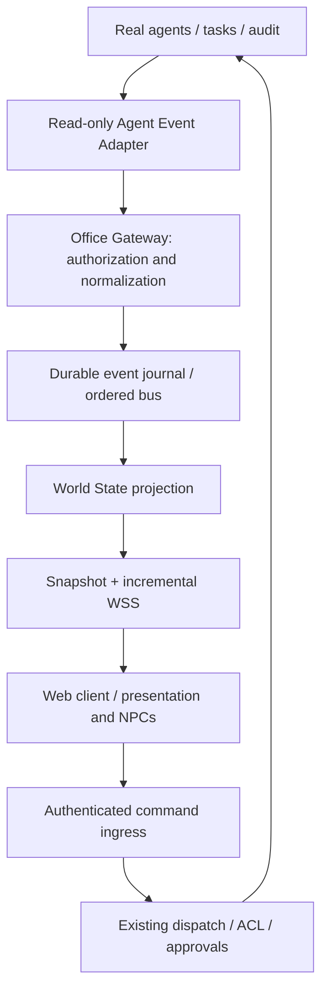

# DOBROPALM Virtual Office — target architecture

Status: target architecture after accepted checkpoint A/B. The first mock C/D increment is implemented; see [implementation status](IMPLEMENTATION_STATUS.md) for delivered scope and deviations. Sources: [discovery](EXISTING_SYSTEM.md), [protocol](EVENT_MODEL.md), [states](AGENT_STATE_MODEL.md), [plan](IMPLEMENTATION_PLAN.md). This design record predates the later [live integration](LIVE_INTEGRATION.md).

## Engine decision

**React + React Three Fiber + Three.js for web hosting**, following the user's clarification after an initial Unreal proposal. Agents/gateway run on the server; the browser is the interface. Unreal is outside the current implementation scope.

| Criterion | Unreal | React + R3F + Three.js |
| --- | --- | --- |
| Characters/animation | More complete skeletal/IK pipeline | PBR/glTF and animation mixer; separate IK/locomotion integration |
| Website delivery | GPU server and Pixel Streaming | Web assets and WSS |
| Client load | Primarily video decoding with streaming | Local WebGL GPU/CPU rendering |
| Server cost | GPU, sessions and bandwidth | Static assets and small gateway; no rendering GPU |
| UI | Streamed UMG | Readable DOM overlay |
| Navigation/furniture | Engine systems | Separate navigation, collision and anchor integration |

**Web hosting does not automatically move WebGL rendering to the server.** Reduce client load with a 30 FPS cap, adaptive DPR, LOD, baked lighting, hidden-tab pause and optional 2D. Fully remote rendering would require a separately evaluated GPU streaming deployment with its own cost, latency and availability. Do not promise zero client load.

The inspected M1 Pro / 16 GB machine is the initial lower test profile. Target initial characters are rigged PBR glTF with hair cards; improve realism after validating animation and performance budgets. Unreal remains a future streaming alternative, not a parallel build. Web assets need licenses and compatible sit/stand/walk/typing skeletons. Evaluate IK/navigation in a bounded spike and pin versions before integration.

Official references checked on 2026-09-23:

- [Unreal macOS requirements](https://dev.epicgames.com/documentation/en-us/unreal-engine/macos-development-requirements-for-unreal-engine).
- [MetaHuman requirements](https://dev.epicgames.com/documentation/metahuman/metahuman-hardware-requirements-in-unreal-engine?lang=en-US).
- [IK Rig](https://dev.epicgames.com/documentation/unreal-engine/unreal-engine-ik-rig), [Motion Matching](https://dev.epicgames.com/documentation/unreal-engine/motion-matching-in-unreal-engine).
- [R3F introduction](https://r3f.docs.pmnd.rs/getting-started/introduction), [performance](https://r3f.docs.pmnd.rs/advanced/scaling-performance).

## Independent layers

The proposed gateway is a separate Bun/TypeScript service with its own SQLite projection/journal, initially mock-only on loopback. One writer serializes events and WorldState in a transaction. A single office does not need Kafka/Redis. Engine-neutral schemas import no Bun, Three.js, Telegram or LLM SDK.

Minimally invasive integration exposes a narrow owner-scoped projection and post-commit invalidation notifications; the adapter rereads committed state. Backend hooks enqueue sanitized invalidations without waiting on office networking. Gateway outages cannot stop agents. Queue loss marks degraded state and triggers reconciliation; best-effort events are not a full audit. Add finer lifecycle hooks separately with tests. Never import `db.ts` directly into the gateway: importing it initializes the database.

## WorldState

`{schemaVersion, streamId, seq, generatedAt, sourceHealth, agents, tasks, communications, meetings, infrastructure, projects}`.

Maps use stable IDs/revisions. Tasks carry confirmed backend state, ownership, assignment and nullable progress. Communications carry sender/recipient, task correlation and safe summaries. Meetings represent backend intent with participants/topics/status. Projects contain display names and verified repository references. Infrastructure defaults to unavailable without invented uptime. Deletions use tombstones. Bound recent actions/communications and paginate history; exclude raw logs from snapshots.

Positions, poses, coffee, gaze and paths belong to local PresentationWorld. Clients may show different ambient movement for the same actual work.

## Client interaction

`OfficeConnection` validates transport; `WorldStateStore` applies the reducer; `AgentController` selects visual intent; `AgentCharacter` handles locomotion/animation. Configuration binds agentId, workstationId, avatar and seat anchors. Gameplay has no provider credentials or prompts.

The third-person player uses kinematic movement, collision and follow camera, with input abstraction for future first-person/mobile/VR. NPC navigation includes avoidance, seat reservation, alignment/sit/stand clips, bounded gaze and blending. Nearby interaction uses a configurable roughly two-meter radius and line of sight. Gaze never calls the backend; UI focus disables movement input.

Inspect overlays expose role/task/status/project/file/repository/branch/actions/tools/tests/progress/blockers with freshness/provenance. Unknown values display no data. Distant monitors use cheap materials, not desktop capture. Repository links require validated HTTPS hosts; no shell/file URLs.

Direct chat targets a roleId through the existing execution/ACL boundary, without a mandatory Lead hop. Conversation does not cancel active work: queue under existing policy with explicit accepted/queued/completed/failed states. Mock chat is labeled MOCK; before real ingress, directChat capability is false.

Initial layout: a realistically scaled modern office, twelve specialist slots plus Lead, with eleven specialist slots occupied; glass meeting room, lounge/kitchen and server-room shell. PBR wood/metal/glass and natural lighting. Start with one workstation and scale after the vertical slice.

## Trust boundaries and risks

Use an owner-scoped session, TLS outside loopback and short-lived WebSocket tickets. Authenticate before snapshot/replay; revocation closes sockets. Apply scope before stream creation, not only rendering. Reconnect never increases privileges. Backend credentials stay server-side.

Build DTOs through allowlists. Exclude system prompts, hidden reasoning, raw tool arguments/results, environment, keys, signed URLs and raw terminal output. Task titles and filenames may also contain secrets: bounded sanitization plus explicit visibility policy; omit unsafe fields. Summaries describe observable activity, not chain-of-thought.

Commands are separate from events. Deploy/stop/restart/delete require existing backend approval bound to actor/action/payload digest/expiry and used once. A button is not authorization. These actions are outside the MVP.

Risks: incomplete telemetry (unknown/stale), concurrent role activity (run IDs), lost process-local events (reconciliation), text leakage (allowlists), duplicate commands (idempotency), heavy assets (performance gates), and initially absent role ingress. Deliver production/client changes as separate tested increments.
